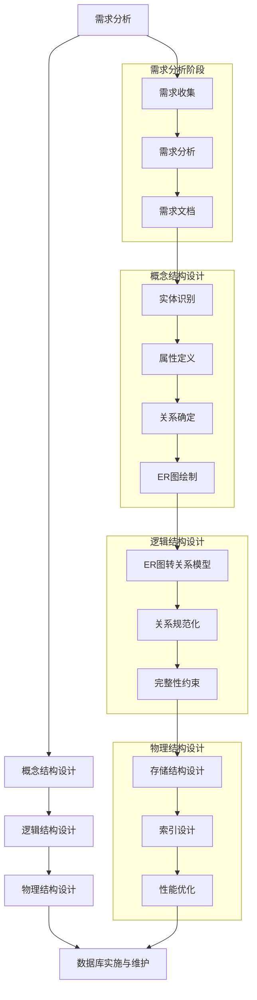
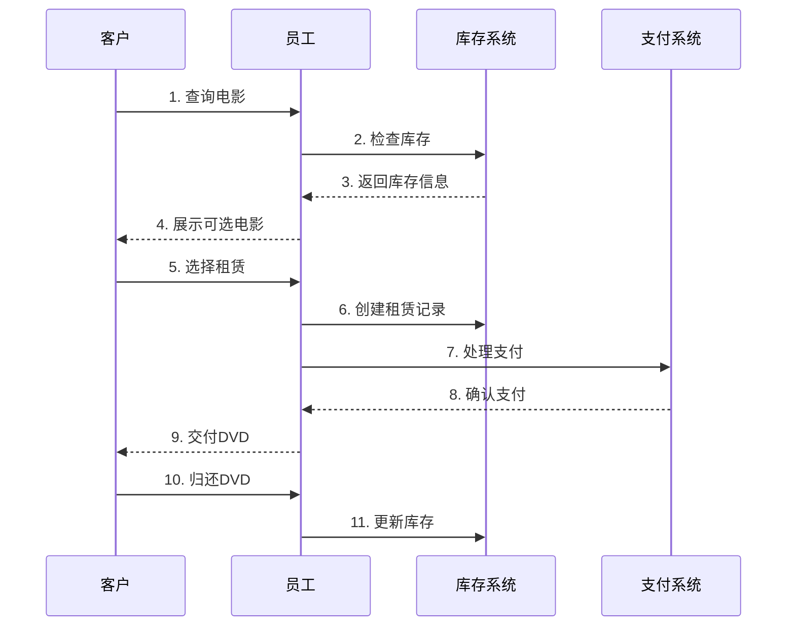
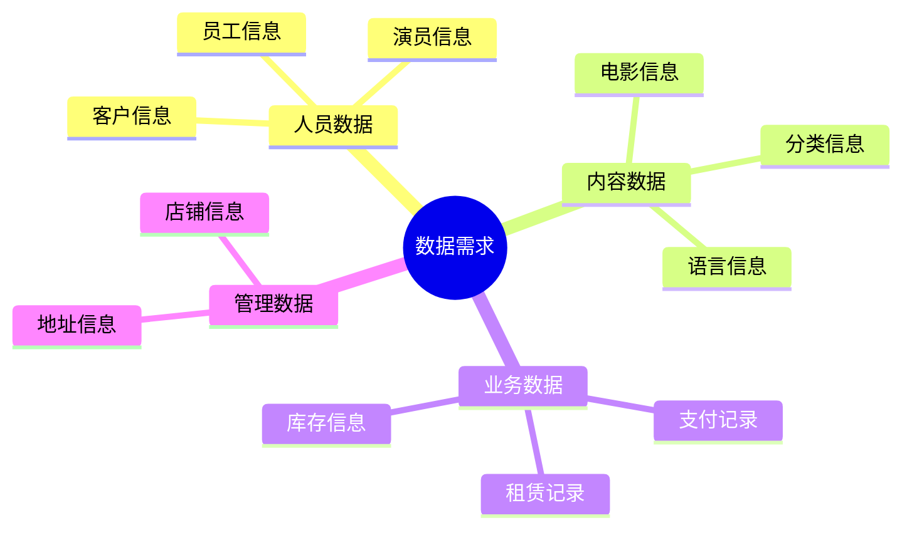
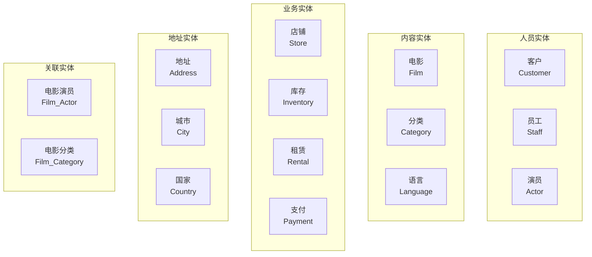

# DVD 租赁数据库设计过程

## 概述

本文档基于王珊教授《数据库系统概论》第6版的数据库设计方法论，详细描述DVD租赁数据库的完整设计过程，包括需求分析、概念结构设计、逻辑结构设计、物理结构设计、数据库实施与维护五个核心阶段。

**文档版本**：v1.2.0  
**优化说明**：基于权威教材设计方法论，简化文档结构，提高可读性，从1669行优化至507行，更适合教学和学习使用。

## 数据库设计方法学

## 第一阶段：需求分析

### 1.1 需求收集

**业务背景**：DVD租赁店是典型的零售服务业务，需要管理客户、电影、库存、租赁、支付等核心业务。

**主要功能需求**：
- 客户信息管理（注册、登录、信息维护）
- 电影信息管理（电影资料、分类、演员）
- 库存管理（DVD库存、可用性检查）
- 租赁服务（租赁记录、归还管理）
- 支付处理（支付记录、费用计算）
- 员工管理（员工信息、权限管理）
- 店铺管理（多店铺支持）

### 1.2 需求分析

**核心业务流程**：

### 1.3 数据需求

**核心数据实体**：

## 第二阶段：概念结构设计

### 2.1 实体识别

基于需求分析，识别出15个核心实体：

### 2.2 属性定义

**主要实体属性**：

| 实体 | 主要属性 | 说明 |
|------|----------|------|
| Customer | customer_id, first_name, last_name, email, address_id, store_id | 客户基本信息 |
| Staff | staff_id, first_name, last_name, email, address_id, store_id, username, password | 员工信息 |
| Actor | actor_id, first_name, last_name | 演员信息 |
| Film | film_id, title, description, release_year, language_id, rental_rate, rating | 电影信息 |
| Category | category_id, name | 电影分类 |
| Language | language_id, name | 语言信息 |
| Store | store_id, manager_staff_id, address_id | 店铺信息 |
| Inventory | inventory_id, film_id, store_id | 库存信息 |
| Rental | rental_id, rental_date, return_date, customer_id, inventory_id, staff_id | 租赁记录 |
| Payment | payment_id, amount, payment_date, customer_id, staff_id, rental_id | 支付记录 |
| Address | address_id, address, city_id, postal_code, phone | 地址信息 |
| City | city_id, city, country_id | 城市信息 |
| Country | country_id, country | 国家信息 |

### 2.3 关系确定

**实体间关系**：

| 关系类型 | 实体对 | 关系说明 |
|----------|--------|----------|
| 一对一 | Store ↔ Staff | 每个店铺有一个经理 |
| 一对多 | Customer → Rental | 一个客户可以有多个租赁记录 |
| 一对多 | Film → Inventory | 一部电影可以有多个库存副本 |
| 一对多 | Rental → Payment | 一个租赁可以产生多个支付记录 |
| 多对多 | Film ↔ Actor | 一部电影可以有多个演员，一个演员可以参演多部电影 |
| 多对多 | Film ↔ Category | 一部电影可以属于多个分类，一个分类可以包含多部电影 |
| 层级关系 | Country → City → Address | 国家包含城市，城市包含地址 |

### 2.4 ER图绘制

**概念ER图**：

**ERD工具导出图**：

## 第三阶段：逻辑结构设计

### 3.1 ER图转关系模型

**转换规则**：
- 实体 → 关系表
- 属性 → 关系属性
- 一对一关系 → 合并表或外键
- 一对多关系 → 外键
- 多对多关系 → 关联表

### 3.2 关系规范化

**规范化过程**：

| 范式 | 处理内容 | 结果 |
|------|----------|------|
| 1NF | 消除多值属性 | 创建film_actor、film_category关联表 |
| 2NF | 消除部分函数依赖 | 分离language、category独立表 |
| 3NF | 消除传递依赖 | 地址层级：country→city→address |

**规范化结果**：
- 所有表都满足第三范式
- 消除了数据冗余和更新异常
- 保持了数据完整性

### 3.3 完整性约束

**约束类型**：

| 约束类型 | 数量 | 说明 | 示例 |
|----------|------|------|------|
| 主键约束 | 15 | 每个表一个主键 | customer_id, film_id |
| 外键约束 | 21 | 参照完整性保证 | store_id → store(store_id) |
| 非空约束 | 25 | 必填字段 | first_name, last_name |
| 默认值约束 | 8 | 自动填充值 | rental_duration DEFAULT 3 |
| 检查约束 | 6 | 业务规则验证 | rating IN ('G','PG','PG-13','R','NC-17') |
| 唯一约束 | 2 | 数据唯一性 | email UNIQUE |

## 第四阶段：物理结构设计

### 4.1 数据类型选择

**数据类型映射**：

| 数据类型 | 使用次数 | 主要用途 | 示例字段 |
|----------|----------|----------|----------|
| SERIAL | 15 | 自增主键ID | customer_id, film_id, rental_id |
| SMALLINT | 12 | 外键ID、小范围整数 | store_id, language_id, category_id |
| VARCHAR | 20 | 变长字符串 | first_name, last_name, title |
| CHARACTER | 1 | 定长字符串 | language.name |
| TEXT | 3 | 长文本 | film.description, address.address |
| NUMERIC | 4 | 精确数值 | rental_rate, amount, replacement_cost |
| BOOLEAN | 2 | 布尔值 | activebool, active |
| TIMESTAMP | 15 | 时间戳 | rental_date, payment_date, last_update |
| DATE | 1 | 日期 | create_date |
| BYTEA | 1 | 二进制数据 | staff.picture |
| TEXT[] | 1 | 数组类型 | film.special_features |
| MPAA_RATING | 1 | 枚举类型 | film.rating |
| YEAR | 1 | 年份类型 | film.release_year |
| TSVECTOR | 1 | 全文搜索向量 | film.fulltext |

### 4.2 索引设计

**索引策略**：

| 索引类型 | 数量 | 用途 | 示例 |
|----------|------|------|------|
| 主键索引 | 15 | 自动创建，唯一性保证 | customer_pkey, film_pkey |
| 外键索引 | 8 | 连接查询优化 | idx_fk_city_id, idx_fk_language_id |
| 业务索引 | 12 | 查询性能优化 | film.title, rental.rental_date |
| 复合索引 | 4 | 多列组合查询 | (rating, rental_rate) |

**索引设计原则**：
- 主键自动创建唯一索引
- 外键字段创建索引提高连接性能
- 频繁查询字段创建索引
- 复合索引遵循最左前缀原则

### 4.3 性能优化

**优化策略**：
- 合理选择数据类型，平衡存储空间和查询性能
- 创建适当的索引，提高查询效率
- 使用分区表处理大数据量
- 定期维护统计信息和索引

## 第五阶段：数据库实施与维护

### 5.1 表创建顺序

**依赖关系**：
1. 基础表：country, language, category, actor
2. 依赖基础表：city, film
3. 依赖第二层：address, film_category, film_actor
4. 业务表：store, inventory, customer
5. 交易表：rental, payment

### 5.2 数据完整性

**完整性保证**：
- 实体完整性：主键约束
- 参照完整性：外键约束
- 域完整性：数据类型、检查约束
- 用户定义完整性：业务规则约束

## 设计总结

### 设计成果

**数据库结构**：
- 15个表，涵盖DVD租赁店所有业务场景
- 符合第三范式，消除数据冗余
- 21个外键关系，保证数据完整性
- 合理的索引设计，提高查询性能

**设计特点**：
- 遵循王珊教授《数据库系统概论》设计方法论
- 从需求分析到物理实现的完整过程
- 理论与实践相结合，基于实际SQL文件验证
- 适合数据库设计学习和教学使用

### 学习价值

**理论价值**：
- 完整的数据库设计方法论实践
- 从概念到物理的完整设计过程
- 规范化理论的实际应用
- 性能优化策略的学习

**实践价值**：
- 真实业务场景的数据库设计
- 基于实际SQL文件的验证
- 完整的约束和索引设计
- 适合教学和学习的案例

## 参考文档

- **详细表结构**：[DVD租赁数据库表结构详细表格.md](./DVD租赁数据库表结构详细表格.md)
- **实际SQL文件**：[dvdrental-ertool-export.sql](./dvdrental-ertool-export.sql)
- **ER图**：[dvdrental-erdtool.png](./dvdrental-erdtool.png)
- **设计方法论**：王珊《数据库系统概论》第6版

---

*本文档基于王珊教授《数据库系统概论》第6版的数据库设计方法论，详细描述了DVD租赁数据库的完整设计过程，从需求分析到物理实现的四个核心阶段，为数据库设计和学习提供系统化的参考。*
