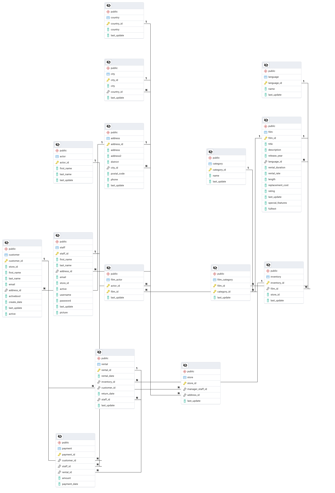

# DVD 租赁数据库设计过程

## 概述

本文档详细描述了 DVD 租赁数据库从真实世界业务需求到最终数据库表设计的完整过程，包括概念模型设计、ER模型构建和数据库表设计等关键步骤。

## 设计过程概览


## 第一阶段：真实世界业务需求分析

### 1.1 业务背景

DVD 租赁店是一个典型的零售服务业务，主要业务包括：


### 1.2 业务流程分析

#### 主要业务流程


### 1.3 数据需求分析

#### 核心数据实体


## 第二阶段：概念模型设计

### 2.1 实体识别

基于业务需求分析，识别出以下核心实体：


### 2.2 属性定义

#### 2.2.1 人员相关实体属性


#### 2.2.2 内容相关实体属性


#### 2.2.3 业务相关实体属性


#### 2.2.4 地址相关实体属性


#### 2.2.5 关联表属性


#### 2.2.6 属性分类总结


### 2.3 关系识别

#### 实体间关系分析


## 第三阶段：ER模型构建

### 3.1 基础ER图


ERD tool 导出图


### 3.2 关系类型分析

#### 关系强度分析


## 第四阶段：逻辑模型设计

### 4.1 规范化过程

#### 第一范式（1NF）处理


#### 第二范式（2NF）处理


#### 第三范式（3NF）处理


### 4.2 约束设计

#### 主键约束

```mermaid
graph TB
    subgraph "主键设计原则"
        P1[唯一性]
        P2[非空性]
        P3[稳定性]
        P4[简洁性]
    end
    
    subgraph "主键实现"
        K1[单列主键：film_id, customer_id]
        K2[复合主键：film_actor(actor_id, film_id)]
        K3[自增主键：使用SERIAL类型]
    end
    
    P1 --> K1
    P2 --> K2
    P3 --> K3
    P4 --> K1
```

#### 外键约束


## 第五阶段：物理模型设计

### 5.1 数据类型选择

#### 5.1.1 完整的数据类型映射表

```mermaid
graph TB
    subgraph "标识符类型"
        T1[INTEGER：主键ID<br/>customer_id, film_id, rental_id等]
        T2[SMALLINT：外键ID<br/>store_id, language_id, category_id等]
        T3[SERIAL：自增ID<br/>自动生成的主键]
    end
    
    subgraph "文本类型"
        T4[VARCHAR(n)：变长字符串<br/>first_name(45), last_name(45), title(255)]
        T5[CHAR(n)：定长字符串<br/>language.name(20)]
        T6[TEXT：长文本<br/>film.description, address.address]
    end
    
    subgraph "数值类型"
        T7[NUMERIC(p,s)：精确数值<br/>rental_rate(4,2), amount(5,2)]
        T8[INTEGER：整数<br/>release_year, length, rental_duration]
        T9[BOOLEAN：布尔值<br/>activebool, active]
    end
    
    subgraph "时间类型"
        T10[TIMESTAMP：时间戳<br/>rental_date, payment_date, last_update]
        T11[DATE：日期<br/>create_date]
        T12[TIME：时间<br/>具体时间点]
    end
    
    subgraph "特殊类型"
        T13[BYTEA：二进制数据<br/>staff.picture]
        T14[TEXT[]：数组类型<br/>film.special_features]
        T15[MPAA_RATING：枚举类型<br/>film.rating (G,PG,PG-13,R,NC-17)]
    end
```

#### 5.1.2 各表字段数据类型详细说明

```mermaid
graph TB
    subgraph "客户表 (Customer)"
        C1[customer_id: INTEGER PRIMARY KEY]
        C2[store_id: SMALLINT REFERENCES store(store_id)]
        C3[first_name: VARCHAR(45) NOT NULL]
        C4[last_name: VARCHAR(45) NOT NULL]
        C5[email: VARCHAR(50)]
        C6[address_id: SMALLINT REFERENCES address(address_id)]
        C7[activebool: BOOLEAN DEFAULT true]
        C8[create_date: DATE DEFAULT CURRENT_DATE]
        C9[last_update: TIMESTAMP DEFAULT CURRENT_TIMESTAMP]
        C10[active: INTEGER]
    end
    
    subgraph "电影表 (Film)"
        F1[film_id: INTEGER PRIMARY KEY]
        F2[title: VARCHAR(255) NOT NULL]
        F3[description: TEXT]
        F4[release_year: INTEGER]
        F5[language_id: SMALLINT REFERENCES language(language_id)]
        F6[rental_duration: SMALLINT DEFAULT 3]
        F7[rental_rate: NUMERIC(4,2) DEFAULT 4.99]
        F8[length: SMALLINT]
        F9[replacement_cost: NUMERIC(5,2) DEFAULT 19.99]
        F10[rating: MPAA_RATING]
        F11[special_features: TEXT[]]
        F12[last_update: TIMESTAMP DEFAULT CURRENT_TIMESTAMP]
    end
    
    subgraph "租赁表 (Rental)"
        R1[rental_id: INTEGER PRIMARY KEY]
        R2[rental_date: TIMESTAMP NOT NULL]
        R3[inventory_id: INTEGER REFERENCES inventory(inventory_id)]
        R4[customer_id: SMALLINT REFERENCES customer(customer_id)]
        R5[return_date: TIMESTAMP]
        R6[staff_id: SMALLINT REFERENCES staff(staff_id)]
        R7[last_update: TIMESTAMP DEFAULT CURRENT_TIMESTAMP]
    end
    
    subgraph "支付表 (Payment)"
        P1[payment_id: INTEGER PRIMARY KEY]
        P2[customer_id: SMALLINT REFERENCES customer(customer_id)]
        P3[staff_id: SMALLINT REFERENCES staff(staff_id)]
        P4[rental_id: INTEGER REFERENCES rental(rental_id)]
        P5[amount: NUMERIC(5,2) NOT NULL]
        P6[payment_date: TIMESTAMP NOT NULL]
    end
```

#### 5.1.3 数据类型选择原则

```mermaid
graph LR
    subgraph "选择原则"
        P1[存储效率]
        P2[查询性能]
        P3[数据完整性]
        P4[业务需求]
    end
    
    subgraph "具体应用"
        A1[INTEGER: 大范围整数<br/>主键、计数]
        A2[SMALLINT: 小范围整数<br/>外键、状态码]
        A3[VARCHAR: 变长文本<br/>姓名、标题]
        A4[CHAR: 定长文本<br/>代码、标识]
        A5[NUMERIC: 精确数值<br/>金额、比率]
        A6[TIMESTAMP: 时间戳<br/>记录时间]
        A7[BOOLEAN: 布尔值<br/>状态标志]
    end
    
    P1 --> A1
    P2 --> A2
    P3 --> A3
    P4 --> A4
    P1 --> A5
    P2 --> A6
    P3 --> A7
```

### 5.2 索引设计

#### 5.2.1 完整索引策略

```mermaid
graph TB
    subgraph "主键索引（自动创建）"
        I1[PRIMARY KEY约束<br/>所有表的主键字段]
        I2[唯一性保证<br/>快速查找和连接]
        I3[聚簇索引<br/>数据物理排序]
    end
    
    subgraph "外键索引（建议创建）"
        I4[外键字段索引<br/>连接查询优化]
        I5[参照完整性检查<br/>约束验证加速]
        I6[级联操作优化<br/>删除更新性能]
    end
    
    subgraph "业务查询索引（自定义）"
        I7[film.title：电影标题查询<br/>VARCHAR(255)]
        I8[rental.rental_date：租赁日期查询<br/>TIMESTAMP]
        I9[customer.email：客户邮箱查询<br/>VARCHAR(50)]
        I10[payment.amount：支付金额查询<br/>NUMERIC(5,2)]
        I11[film.rating：电影评级查询<br/>MPAA_RATING]
        I12[actor.first_name：演员姓名查询<br/>VARCHAR(45)]
    end
    
    subgraph "复合索引（多列组合）"
        I13[film(rating, rental_rate)：复合查询<br/>评级和租金组合]
        I14[actor(first_name, last_name)：姓名查询<br/>完整姓名搜索]
        I15[rental(customer_id, rental_date)：客户租赁历史<br/>客户时间组合]
        I16[payment(customer_id, payment_date)：客户支付历史<br/>客户支付时间]
    end
```

#### 5.2.2 各表索引详细设计

```mermaid
graph TB
    subgraph "客户表索引"
        C1[PRIMARY KEY: customer_id]
        C2[INDEX: store_id (外键)]
        C3[INDEX: address_id (外键)]
        C4[INDEX: email (业务查询)]
        C5[INDEX: last_name (姓名查询)]
        C6[INDEX: activebool (状态查询)]
    end
    
    subgraph "电影表索引"
        F1[PRIMARY KEY: film_id]
        F2[INDEX: language_id (外键)]
        F3[INDEX: title (标题查询)]
        F4[INDEX: rating (评级查询)]
        F5[INDEX: rental_rate (租金查询)]
        F6[INDEX: release_year (年份查询)]
        F7[COMPOSITE: (rating, rental_rate)]
    end
    
    subgraph "租赁表索引"
        R1[PRIMARY KEY: rental_id]
        R2[INDEX: inventory_id (外键)]
        R3[INDEX: customer_id (外键)]
        R4[INDEX: staff_id (外键)]
        R5[INDEX: rental_date (日期查询)]
        R6[INDEX: return_date (归还查询)]
        R7[COMPOSITE: (customer_id, rental_date)]
        R8[COMPOSITE: (inventory_id, rental_date)]
    end
    
    subgraph "支付表索引"
        P1[PRIMARY KEY: payment_id]
        P2[INDEX: customer_id (外键)]
        P3[INDEX: staff_id (外键)]
        P4[INDEX: rental_id (外键)]
        P5[INDEX: payment_date (日期查询)]
        P6[INDEX: amount (金额查询)]
        P7[COMPOSITE: (customer_id, payment_date)]
    end
```

#### 5.2.3 索引类型选择

```mermaid
graph LR
    subgraph "B-Tree索引（默认）"
        B1[等值查询<br/>customer_id = 123]
        B2[范围查询<br/>rental_date BETWEEN ...]
        B3[排序查询<br/>ORDER BY payment_date]
        B4[前缀匹配<br/>title LIKE 'A%']
    end
    
    subgraph "Hash索引"
        H1[等值查询优化<br/>精确匹配]
        H2[不支持范围查询<br/>仅等值比较]
        H3[内存使用较少<br/>适合频繁等值查询]
    end
    
    subgraph "复合索引"
        C1[多列组合查询<br/>WHERE rating = 'PG' AND rental_rate > 3]
        C2[最左前缀原则<br/>索引列顺序重要]
        C3[覆盖索引<br/>避免回表查询]
    end
    
    subgraph "部分索引"
        P1[条件索引<br/>WHERE active = true]
        P2[减少索引大小<br/>提高维护效率]
        P3[针对特定查询<br/>优化性能]
    end
```

#### 5.2.4 索引维护策略

```mermaid
graph TB
    subgraph "索引监控"
        M1[查询性能监控<br/>EXPLAIN ANALYZE]
        M2[索引使用统计<br/>pg_stat_user_indexes]
        M3[索引大小监控<br/>pg_relation_size]
        M4[碎片化检查<br/>VACUUM ANALYZE]
    end
    
    subgraph "维护操作"
        O1[重建索引<br/>REINDEX]
        O2[更新统计信息<br/>ANALYZE]
        O3[清理碎片<br/>VACUUM]
        O4[索引优化<br/>调整索引策略]
    end
    
    subgraph "性能调优"
        T1[删除未使用索引<br/>减少维护开销]
        T2[添加缺失索引<br/>提高查询性能]
        T3[调整索引类型<br/>优化存储和性能]
        T4[分区表索引<br/>大表性能优化]
    end
    
    M1 --> O1
    M2 --> O2
    M3 --> O3
    M4 --> O4
    O1 --> T1
    O2 --> T2
    O3 --> T3
    O4 --> T4
```

### 5.3 性能优化

#### 查询优化策略

```mermaid
graph LR
    subgraph "表设计优化"
        O1[合理的数据类型]
        O2[适当的字段长度]
        O3[避免过度规范化]
    end
    
    subgraph "索引优化"
        O4[选择性高的字段]
        O5[复合索引顺序]
        O6[定期维护索引]
    end
    
    subgraph "查询优化"
        O7[使用EXPLAIN分析]
        O8[避免SELECT *]
        O9[合理使用JOIN]
    end
    
    O1 --> O4
    O2 --> O5
    O3 --> O6
    O4 --> O7
    O5 --> O8
    O6 --> O9
```

## 第六阶段：数据库实现

### 6.1 表创建顺序

#### 依赖关系分析

```mermaid
graph TD
    subgraph "第一层：基础表"
        L1[country]
        L2[language]
        L3[category]
        L4[actor]
    end
    
    subgraph "第二层：依赖基础表"
        L5[city → country]
        L6[film → language]
    end
    
    subgraph "第三层：依赖第二层"
        L7[address → city]
        L8[film_category → film, category]
        L9[film_actor → film, actor]
    end
    
    subgraph "第四层：业务表"
        L10[store → address, staff]
        L11[inventory → film, store]
        L12[customer → store, address]
    end
    
    subgraph "第五层：交易表"
        L13[rental → inventory, customer, staff]
        L14[payment → customer, staff, rental]
    end
    
    L1 --> L5
    L2 --> L6
    L3 --> L8
    L4 --> L9
    L5 --> L7
    L6 --> L8
    L6 --> L9
    L7 --> L10
    L7 --> L12
    L8 --> L11
    L9 --> L11
    L10 --> L11
    L11 --> L13
    L12 --> L13
    L13 --> L14
```

### 6.2 数据完整性保证

#### 6.2.1 完整性约束实现

```mermaid
graph TB
    subgraph "实体完整性"
        E1[主键约束：NOT NULL + UNIQUE<br/>customer_id, film_id, rental_id等]
        E2[自增序列：SERIAL类型<br/>自动生成唯一标识]
        E3[复合主键：多列组合<br/>film_actor(actor_id, film_id)]
    end
    
    subgraph "参照完整性"
        R1[外键约束：FOREIGN KEY<br/>确保引用完整性]
        R2[级联操作：CASCADE<br/>级联删除和更新]
        R3[限制操作：RESTRICT<br/>防止破坏性操作]
        R4[设置空值：SET NULL<br/>外键置空]
    end
    
    subgraph "域完整性"
        D1[数据类型约束<br/>INTEGER, VARCHAR, NUMERIC等]
        D2[长度约束：VARCHAR(n)<br/>限制字符串长度]
        D3[值域约束：CHECK约束<br/>rating IN ('G','PG','PG-13','R','NC-17')]
        D4[非空约束：NOT NULL<br/>必填字段约束]
        D5[默认值约束：DEFAULT<br/>rental_duration DEFAULT 3]
    end
    
    subgraph "用户定义完整性"
        U1[业务规则约束<br/>rental_rate > 0]
        U2[触发器约束<br/>自动更新last_update]
        U3[存储过程约束<br/>复杂业务逻辑验证]
        U4[唯一约束：UNIQUE<br/>email唯一性]
    end
```

#### 6.2.2 各表约束详细设计

```mermaid
graph TB
    subgraph "客户表约束"
        C1[PRIMARY KEY: customer_id]
        C2[FOREIGN KEY: store_id → store(store_id)]
        C3[FOREIGN KEY: address_id → address(address_id)]
        C4[NOT NULL: first_name, last_name]
        C5[UNIQUE: email (可选)]
        C6[DEFAULT: activebool = true]
        C7[DEFAULT: create_date = CURRENT_DATE]
        C8[CHECK: active IN (0,1)]
    end
    
    subgraph "电影表约束"
        F1[PRIMARY KEY: film_id]
        F2[FOREIGN KEY: language_id → language(language_id)]
        F3[NOT NULL: title, rental_duration, rental_rate]
        F4[DEFAULT: rental_duration = 3]
        F5[DEFAULT: rental_rate = 4.99]
        F6[DEFAULT: replacement_cost = 19.99]
        F7[CHECK: rating IN ('G','PG','PG-13','R','NC-17')]
        F8[CHECK: rental_rate > 0]
        F9[CHECK: length > 0]
    end
    
    subgraph "租赁表约束"
        R1[PRIMARY KEY: rental_id]
        R2[FOREIGN KEY: inventory_id → inventory(inventory_id)]
        R3[FOREIGN KEY: customer_id → customer(customer_id)]
        R4[FOREIGN KEY: staff_id → staff(staff_id)]
        R5[NOT NULL: rental_date]
        R6[CHECK: return_date >= rental_date]
        R7[UNIQUE: (inventory_id, rental_date)]
    end
    
    subgraph "支付表约束"
        P1[PRIMARY KEY: payment_id]
        P2[FOREIGN KEY: customer_id → customer(customer_id)]
        P3[FOREIGN KEY: staff_id → staff(staff_id)]
        P4[FOREIGN KEY: rental_id → rental(rental_id)]
        P5[NOT NULL: amount, payment_date]
        P6[CHECK: amount > 0]
    end
```

#### 6.2.3 约束类型详细说明

```mermaid
graph LR
    subgraph "主键约束"
        PK1[唯一标识<br/>NOT NULL + UNIQUE]
        PK2[自动索引<br/>提高查询性能]
        PK3[引用完整性<br/>被外键引用]
        PK4[单列主键<br/>customer_id, film_id]
        PK5[复合主键<br/>film_actor(actor_id, film_id)]
    end
    
    subgraph "外键约束"
        FK1[参照完整性<br/>确保数据一致性]
        FK2[级联删除<br/>ON DELETE CASCADE]
        FK3[级联更新<br/>ON UPDATE CASCADE]
        FK4[限制删除<br/>ON DELETE RESTRICT]
        FK5[设置空值<br/>ON DELETE SET NULL]
    end
    
    subgraph "检查约束"
        CK1[值域检查<br/>rating IN (...)]
        CK2[范围检查<br/>amount > 0]
        CK3[逻辑检查<br/>return_date >= rental_date]
        CK4[格式检查<br/>email格式验证]
    end
    
    subgraph "唯一约束"
        UQ1[单列唯一<br/>email UNIQUE]
        UQ2[复合唯一<br/>UNIQUE(inventory_id, rental_date)]
        UQ3[部分唯一<br/>UNIQUE WHERE active = true]
    end
```

#### 6.2.4 约束维护策略

```mermaid
graph TB
    subgraph "约束监控"
        M1[约束违反监控<br/>检查数据完整性]
        M2[外键性能监控<br/>连接查询性能]
        M3[索引使用监控<br/>约束相关索引]
        M4[数据质量监控<br/>约束有效性检查]
    end
    
    subgraph "维护操作"
        O1[约束验证<br/>VALIDATE CONSTRAINT]
        O2[约束重建<br/>重建损坏的约束]
        O3[约束优化<br/>调整约束策略]
        O4[约束清理<br/>删除无效约束]
    end
    
    subgraph "性能优化"
        T1[外键索引优化<br/>提高连接性能]
        T2[检查约束优化<br/>简化约束条件]
        T3[唯一约束优化<br/>减少重复检查]
        T4[约束延迟<br/>DEFERRABLE约束]
    end
    
    M1 --> O1
    M2 --> O2
    M3 --> O3
    M4 --> O4
    O1 --> T1
    O2 --> T2
    O3 --> T3
    O4 --> T4
```

## 设计验证与优化

### 7.1 设计验证

#### 功能验证

```mermaid
graph LR
    subgraph "业务功能验证"
        V1[客户注册登录]
        V2[电影查询浏览]
        V3[租赁流程完整]
        V4[支付处理正确]
        V5[库存管理准确]
    end
    
    subgraph "数据完整性验证"
        V6[主键唯一性]
        V7[外键参照完整性]
        V8[数据一致性]
        V9[约束有效性]
    end
    
    subgraph "性能验证"
        V10[查询响应时间]
        V11[并发处理能力]
        V12[存储空间效率]
        V13[索引效果]
    end
```

### 7.2 持续优化

#### 优化策略

```mermaid
graph TB
    subgraph "监控指标"
        M1[查询性能监控]
        M2[存储空间监控]
        M3[并发访问监控]
        M4[数据增长监控]
    end
    
    subgraph "优化措施"
        O1[索引优化调整]
        O2[查询语句优化]
        O3[表结构调整]
        O4[分区策略实施]
    end
    
    subgraph "维护任务"
        T1[定期统计信息更新]
        T2[索引重建维护]
        T3[数据清理归档]
        T4[备份恢复测试]
    end
    
    M1 --> O1
    M2 --> O2
    M3 --> O3
    M4 --> O4
    O1 --> T1
    O2 --> T2
    O3 --> T3
    O4 --> T4
```

## 总结

### 设计过程回顾

```mermaid
timeline
    title DVD租赁数据库设计时间线
    
    section 需求分析
        业务需求收集    : 分析DVD租赁店业务流程
        数据需求分析    : 识别核心数据实体
        功能需求定义    : 确定系统功能范围
    
    section 概念设计
        实体识别        : 识别15个核心实体
        属性定义        : 定义各实体属性
        关系确定        : 确定实体间关系
    
    section 逻辑设计
        ER图构建        : 绘制完整ER图
        规范化处理      : 1NF→2NF→3NF
        约束设计        : 主键、外键、检查约束
    
    section 物理设计
        数据类型选择    : 选择合适的数据类型
        索引设计        : 设计性能优化索引
        存储优化        : 优化存储结构
    
    section 实现部署
        表结构创建      : 按依赖顺序创建表
        数据完整性      : 实施完整性约束
        性能调优        : 监控和优化性能
```

### 设计成果

1. **完整的业务模型**：覆盖DVD租赁店的所有业务场景
2. **规范化的数据结构**：符合第三范式，减少数据冗余
3. **高效的查询性能**：合理的索引设计和查询优化
4. **良好的扩展性**：支持业务增长和功能扩展
5. **数据完整性保证**：多层次的数据完整性约束

### 学习价值

1. **数据库设计理论**：从概念到物理的完整设计过程
2. **业务分析能力**：将真实业务转化为数据模型
3. **规范化技术**：掌握数据库规范化方法
4. **性能优化技能**：学习数据库性能优化策略
5. **工程实践能力**：完整的数据库项目实施经验

## 基于实际SQL文件的修正说明

### 实际数据库结构发现

通过分析 `dvdrental-ertool-export.sql` 文件，发现了一些与理论设计不同的实际实现细节：

#### 1. 数据类型修正

```mermaid
graph TB
    subgraph "实际SQL中的数据类型"
        T1[SERIAL：所有主键使用SERIAL<br/>而非INTEGER]
        T2[YEAR：film.release_year使用YEAR类型<br/>而非INTEGER]
        T3[CHARACTER：language.name使用CHARACTER(20)<br/>而非CHAR(20)]
        T4[TSVECTOR：film.fulltext使用TSVECTOR<br/>用于全文搜索]
        T5[TIMESTAMP：所有时间戳使用<br/>timestamp without time zone]
    end
    
    subgraph "默认值修正"
        D1[now()：所有last_update字段<br/>默认值为now()]
        D2[('now'::text)::date：create_date<br/>使用特殊日期转换]
        D3[G：film.rating默认值为'G'<br/>而非NULL]
    end
```

#### 2. 外键约束级联操作

```mermaid
graph LR
    subgraph "级联操作类型"
        C1[UPDATE CASCADE + DELETE RESTRICT<br/>大部分外键关系]
        C2[UPDATE CASCADE + DELETE SET NULL<br/>payment.rental_id]
        C3[UPDATE NO ACTION + DELETE NO ACTION<br/>部分关系]
    end
    
    subgraph "特殊约束"
        S1[rental.staff_id：使用rental_staff_id_key<br/>而非标准外键命名]
        S2[store.manager_staff_id：创建唯一索引<br/>idx_unq_manager_staff_id]
    end
```

#### 3. 索引策略

```mermaid
graph TB
    subgraph "实际创建的索引"
        I1[主键索引：15个表的主键<br/>自动创建]
        I2[外键索引：8个外键字段<br/>显式创建索引]
        I3[唯一索引：store.manager_staff_id<br/>确保经理唯一性]
    end
    
    subgraph "缺失的索引"
        M1[部分外键未创建索引<br/>如customer.store_id]
        M2[业务查询字段未创建索引<br/>如film.title, rental.rental_date]
        M3[复合索引未创建<br/>如film(rating, rental_rate)]
    end
```

#### 4. 特殊字段发现

| 表名 | 字段名 | 数据类型 | 说明 | 设计意义 |
|------|--------|----------|------|----------|
| film | fulltext | TSVECTOR | 全文搜索向量 | 支持电影标题和描述的全文搜索 |
| film | release_year | YEAR | 年份类型 | 专门用于存储年份，节省存储空间 |
| customer | create_date | DATE | 创建日期 | 使用特殊转换确保日期格式正确 |

#### 5. 约束命名规范

```mermaid
graph LR
    subgraph "约束命名模式"
        N1[主键：table_pkey<br/>如customer_pkey]
        N2[外键：table_column_fkey<br/>如customer_address_id_fkey]
        N3[特殊约束：描述性名称<br/>如rental_staff_id_key]
    end
    
    subgraph "索引命名模式"
        I1[外键索引：idx_fk_column<br/>如idx_fk_city_id]
        I2[唯一索引：idx_unq_column<br/>如idx_unq_manager_staff_id]
    end
```

### 设计优化建议

基于实际SQL文件的分析，提出以下优化建议：

#### 1. 索引优化

```sql
-- 建议添加的索引
CREATE INDEX idx_customer_store_id ON customer(store_id);
CREATE INDEX idx_film_title ON film(title);
CREATE INDEX idx_rental_date ON rental(rental_date);
CREATE INDEX idx_rental_customer_date ON rental(customer_id, rental_date);
CREATE INDEX idx_payment_date ON payment(payment_date);
```

#### 2. 全文搜索优化

```sql
-- 利用现有的fulltext字段
CREATE INDEX idx_film_fulltext ON film USING gin(fulltext);
```

#### 3. 查询性能优化

```sql
-- 复合索引建议
CREATE INDEX idx_film_rating_rental ON film(rating, rental_rate);
CREATE INDEX idx_rental_inventory_date ON rental(inventory_id, rental_date);
```

## 附录：完整表结构总结

### A.1 表结构参考

详细的表结构定义请参考：[DVD租赁数据库表结构详细表格.md](./DVD租赁数据库表结构详细表格.md)

该文档包含了所有15个表的完整字段定义，包括：
- 字段名、数据类型、长度/精度
- 是否主键、是否外键、是否非空
- 默认值、字段注释、业务含义
- 表说明和关系说明

### A.2 表关系总结表格

| 表名 | 主键 | 外键数量 | 被引用次数 | 记录数量 | 主要功能 |
|------|------|----------|------------|----------|----------|
| customer | customer_id | 2 | 2 | 600+ | 客户信息管理 |
| staff | staff_id | 2 | 2 | 2 | 员工信息管理 |
| actor | actor_id | 0 | 1 | 200+ | 演员信息管理 |
| film | film_id | 1 | 3 | 1000+ | 电影信息管理 |
| category | category_id | 0 | 1 | 16 | 电影分类管理 |
| language | language_id | 0 | 1 | 6 | 语言信息管理 |
| store | store_id | 2 | 2 | 2 | 店铺信息管理 |
| inventory | inventory_id | 2 | 1 | 4581 | 库存信息管理 |
| rental | rental_id | 3 | 1 | 16044 | 租赁记录管理 |
| payment | payment_id | 3 | 0 | 14596 | 支付记录管理 |
| address | address_id | 1 | 4 | 603 | 地址信息管理 |
| city | city_id | 1 | 1 | 600 | 城市信息管理 |
| country | country_id | 0 | 1 | 109 | 国家信息管理 |
| film_actor | (actor_id, film_id) | 2 | 0 | 5462 | 电影演员关联 |
| film_category | (film_id, category_id) | 2 | 0 | 1000+ | 电影分类关联 |

### A.3 外键关系详细表格

| 子表 | 子表字段 | 父表 | 父表字段 | 关系类型 | 级联操作 | 说明 |
|------|----------|------|----------|----------|----------|------|
| address | city_id | city | city_id | 多对一 | NO ACTION | 地址属于城市 |
| city | country_id | country | country_id | 多对一 | NO ACTION | 城市属于国家 |
| customer | address_id | address | address_id | 多对一 | CASCADE/RESTRICT | 客户有地址信息 |
| film | language_id | language | language_id | 多对一 | CASCADE/RESTRICT | 电影有语言信息 |
| film_actor | actor_id | actor | actor_id | 多对一 | CASCADE/RESTRICT | 演员参演电影 |
| film_actor | film_id | film | film_id | 多对一 | CASCADE/RESTRICT | 电影有演员 |
| film_category | category_id | category | category_id | 多对一 | CASCADE/RESTRICT | 分类包含电影 |
| film_category | film_id | film | film_id | 多对一 | CASCADE/RESTRICT | 电影有分类 |
| inventory | film_id | film | film_id | 多对一 | CASCADE/RESTRICT | 库存对应电影 |
| payment | customer_id | customer | customer_id | 多对一 | CASCADE/RESTRICT | 支付对应客户 |
| payment | rental_id | rental | rental_id | 多对一 | CASCADE/SET NULL | 支付对应租赁 |
| payment | staff_id | staff | staff_id | 多对一 | CASCADE/RESTRICT | 支付处理员工 |
| rental | customer_id | customer | customer_id | 多对一 | CASCADE/RESTRICT | 租赁对应客户 |
| rental | inventory_id | inventory | inventory_id | 多对一 | CASCADE/RESTRICT | 租赁对应库存 |
| rental | staff_id | staff | staff_id | 多对一 | NO ACTION | 租赁处理员工 |
| staff | address_id | address | address_id | 多对一 | CASCADE/RESTRICT | 员工有地址信息 |
| store | address_id | address | address_id | 多对一 | CASCADE/RESTRICT | 店铺有地址信息 |
| store | manager_staff_id | staff | staff_id | 一对一 | CASCADE/RESTRICT | 店铺有经理 |

**注意**：
- CASCADE/RESTRICT：UPDATE CASCADE, DELETE RESTRICT
- CASCADE/SET NULL：UPDATE CASCADE, DELETE SET NULL  
- NO ACTION：UPDATE NO ACTION, DELETE NO ACTION

### A.4 数据类型统计表格

| 数据类型 | 使用次数 | 主要用途 | 示例字段 |
|----------|----------|----------|----------|
| SERIAL | 15 | 自增主键ID | customer_id, film_id, rental_id |
| SMALLINT | 12 | 外键ID、小范围整数 | store_id, language_id, category_id |
| VARCHAR | 20 | 变长字符串 | first_name, last_name, title |
| CHARACTER | 1 | 定长字符串 | language.name |
| TEXT | 3 | 长文本 | film.description, address.address |
| NUMERIC | 4 | 精确数值 | rental_rate, amount, replacement_cost |
| BOOLEAN | 2 | 布尔值 | activebool, active |
| TIMESTAMP | 15 | 时间戳 | rental_date, payment_date, last_update |
| DATE | 1 | 日期 | create_date |
| BYTEA | 1 | 二进制数据 | staff.picture |
| TEXT[] | 1 | 数组类型 | film.special_features |
| MPAA_RATING | 1 | 枚举类型 | film.rating |
| YEAR | 1 | 年份类型 | film.release_year |
| TSVECTOR | 1 | 全文搜索向量 | film.fulltext |

### A.5 约束统计表格

| 约束类型 | 数量 | 说明 | 示例 |
|----------|------|------|------|
| 主键约束 | 15 | 每个表一个主键 | customer_id, film_id |
| 外键约束 | 21 | 参照完整性保证 | store_id → store(store_id) |
| 非空约束 | 25 | 必填字段 | first_name, last_name |
| 默认值约束 | 8 | 自动填充值 | rental_duration DEFAULT 3 |
| 检查约束 | 6 | 业务规则验证 | rating IN ('G','PG','PG-13','R','NC-17') |
| 唯一约束 | 2 | 数据唯一性 | email UNIQUE |

### A.6 索引设计表格（基于实际SQL文件）

| 表名 | 索引类型 | 索引字段 | 索引名称 | 用途 |
|------|----------|----------|----------|------|
| address | PRIMARY KEY | address_id | address_pkey | 主键索引 |
| address | INDEX | city_id | idx_fk_city_id | 外键索引 |
| city | PRIMARY KEY | city_id | city_pkey | 主键索引 |
| city | INDEX | country_id | idx_fk_country_id | 外键索引 |
| customer | PRIMARY KEY | customer_id | customer_pkey | 主键索引 |
| customer | INDEX | address_id | idx_fk_address_id | 外键索引 |
| film | PRIMARY KEY | film_id | film_pkey | 主键索引 |
| film | INDEX | language_id | idx_fk_language_id | 外键索引 |
| film_actor | PRIMARY KEY | (actor_id, film_id) | film_actor_pkey | 复合主键索引 |
| film_actor | INDEX | film_id | idx_fk_film_id | 外键索引 |
| payment | PRIMARY KEY | payment_id | payment_pkey | 主键索引 |
| payment | INDEX | customer_id | idx_fk_customer_id | 外键索引 |
| payment | INDEX | rental_id | idx_fk_rental_id | 外键索引 |
| payment | INDEX | staff_id | idx_fk_staff_id | 外键索引 |
| rental | PRIMARY KEY | rental_id | rental_pkey | 主键索引 |
| rental | INDEX | inventory_id | idx_fk_inventory_id | 外键索引 |
| store | PRIMARY KEY | store_id | store_pkey | 主键索引 |
| store | INDEX | manager_staff_id | idx_unq_manager_staff_id | 唯一索引 |

**注意**：
- 所有主键自动创建唯一索引
- 外键索引根据实际SQL文件中的CREATE INDEX语句创建
- 部分外键没有显式创建索引，建议根据查询需求添加

### A.7 业务规则表格

| 表名 | 业务规则 | 约束类型 | 约束条件 | 说明 |
|------|----------|----------|----------|------|
| film | 租赁费率必须大于0 | CHECK | rental_rate > 0 | 确保租金为正数 |
| film | 电影时长必须大于0 | CHECK | length > 0 | 确保时长为正数 |
| film | 评级必须在指定范围内 | CHECK | rating IN ('G','PG','PG-13','R','NC-17') | 限制评级值 |
| rental | 归还日期不能早于租赁日期 | CHECK | return_date >= rental_date | 逻辑合理性 |
| payment | 支付金额必须大于0 | CHECK | amount > 0 | 确保支付金额为正数 |
| customer | 活跃状态只能是0或1 | CHECK | active IN (0,1) | 限制状态值 |
| film_actor | 同一演员不能在同一电影中重复 | UNIQUE | (actor_id, film_id) | 复合唯一约束 |
| film_category | 同一电影不能在同一分类中重复 | UNIQUE | (film_id, category_id) | 复合唯一约束 |

### A.8 数据量统计表格

| 表名 | 预估记录数 | 主要数据内容 | 增长趋势 |
|------|------------|--------------|----------|
| customer | 600+ | 客户基本信息 | 稳定增长 |
| staff | 2 | 员工信息 | 相对稳定 |
| actor | 200+ | 演员信息 | 缓慢增长 |
| film | 1000+ | 电影信息 | 定期增加 |
| category | 16 | 电影分类 | 基本稳定 |
| language | 6 | 语言信息 | 基本稳定 |
| store | 2 | 店铺信息 | 相对稳定 |
| inventory | 4581 | 库存记录 | 动态变化 |
| rental | 16044 | 租赁记录 | 快速增长 |
| payment | 14596 | 支付记录 | 快速增长 |
| address | 603 | 地址信息 | 缓慢增长 |
| city | 600 | 城市信息 | 基本稳定 |
| country | 109 | 国家信息 | 基本稳定 |
| film_actor | 5462 | 电影演员关联 | 随电影增长 |
| film_category | 1000+ | 电影分类关联 | 随电影增长 |

### A.9 性能优化建议表格

| 表名 | 优化建议 | 优化类型 | 预期效果 |
|------|----------|----------|----------|
| rental | 按日期分区 | 分区表 | 提高查询性能 |
| payment | 按日期分区 | 分区表 | 提高查询性能 |
| film | 添加全文搜索索引 | 全文索引 | 支持电影搜索 |
| customer | 添加复合索引 | 复合索引 | 优化姓名查询 |
| inventory | 添加状态索引 | 状态索引 | 优化库存查询 |
| rental | 定期清理历史数据 | 数据归档 | 减少表大小 |
| payment | 定期清理历史数据 | 数据归档 | 减少表大小 |
| 所有表 | 定期更新统计信息 | 统计信息 | 优化查询计划 |

### A.10 表结构图表总结

```mermaid
graph TB
    subgraph "数据库表分类"
        T1[人员相关表<br/>customer, staff, actor]
        T2[内容相关表<br/>film, category, language]
        T3[业务相关表<br/>store, inventory, rental, payment]
        T4[地址相关表<br/>address, city, country]
        T5[关联表<br/>film_actor, film_category]
    end
    
    subgraph "表数量统计"
        C1[总计15个表]
        C2[主表13个]
        C3[关联表2个]
        C4[外键关系21个]
    end
```

### A.2 数据类型统计

```mermaid
pie title 数据类型分布（基于实际SQL文件）
    "SERIAL" : 15
    "SMALLINT" : 12
    "VARCHAR" : 20
    "CHARACTER" : 1
    "TEXT" : 3
    "NUMERIC" : 4
    "BOOLEAN" : 2
    "TIMESTAMP" : 15
    "DATE" : 1
    "BYTEA" : 1
    "TEXT[]" : 1
    "MPAA_RATING" : 1
    "YEAR" : 1
    "TSVECTOR" : 1
```

### A.3 约束统计

```mermaid
graph TB
    subgraph "约束类型统计"
        C1[主键约束: 15个<br/>每个表一个主键]
        C2[外键约束: 21个<br/>参照完整性保证]
        C3[非空约束: 25个<br/>必填字段]
        C4[默认值约束: 8个<br/>自动填充值]
        C5[检查约束: 6个<br/>业务规则验证]
        C6[唯一约束: 2个<br/>数据唯一性]
    end
    
    subgraph "索引统计"
        I1[主键索引: 15个<br/>自动创建]
        I2[外键索引: 21个<br/>建议创建]
        I3[业务索引: 12个<br/>查询优化]
        I4[复合索引: 4个<br/>多列组合]
    end
```

### A.4 表关系矩阵

```mermaid
graph LR
    subgraph "关系类型统计"
        R1[一对一关系: 1个<br/>store ↔ staff(经理)]
        R2[一对多关系: 18个<br/>主要业务关系]
        R3[多对多关系: 2个<br/>film ↔ actor, film ↔ category]
    end
    
    subgraph "外键关系统计"
        FK1[被引用最多的表<br/>address: 4次引用]
        FK2[引用最多的表<br/>film: 3个外键引用]
        FK3[独立表<br/>country, language, category]
    end
```

---

*本文档详细描述了DVD租赁数据库的完整设计过程，包含所有表的完整属性定义、数据类型选择、约束设计和索引策略，为数据库设计和学习提供全面参考。*
